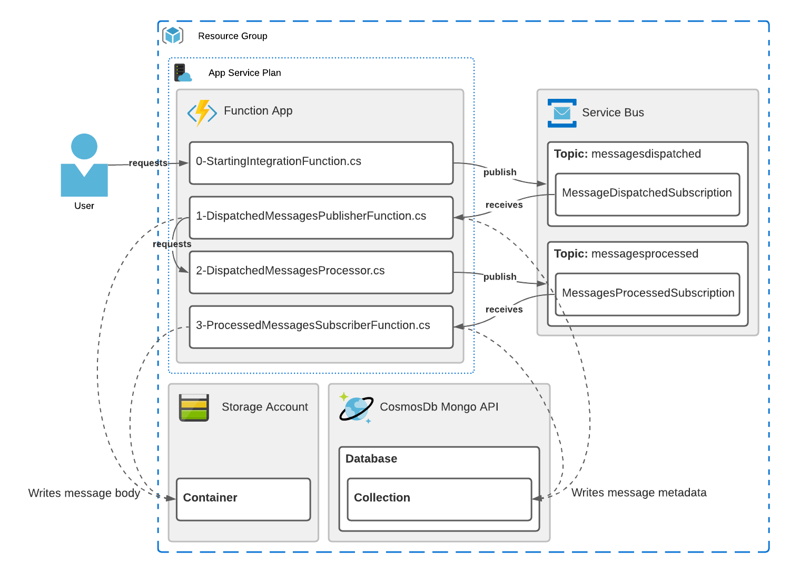

# Azure Functions Lab

A Lab to tryout workflows with C# Azure Functions using HTTP and Azure Service Bus Triggers

## Implementation



The lab consisting in:
- A `0-StartingIntegrationFunction` function exposing a HTTP API to start the process flow;
- `0-StartingIntegrationFunction` function publish a message in the `messagedispatched` Azure Service Bus Topic;
- `1-DispatchedMessagesPublisherFunction` function listen the topic via `MessageDispatchedSubscription` and POST data to a HTTP API exposed by `2-DispatchedMessagesProcessor` function;
- `2-DispatchedMessagesProcessor` function publish another processed message into `messagesprocessed` Azure Service Bus Topic;
- `3-ProcessedMessagesSubscriberFunction` listen the topic via `MessagesProcessedSubscription`;

All the functions has instructions (`Failure.AtRateOf(xx);`) to fail at some "rate" to simulate failures and prove process resiliency via retries. <br />
Functions triggered by HTTP handles retries via attribute decoration (`[FixedDelayRetry(xx, "hh:mm:ss")]`) while Service Bus triggered Functions retries automatically whenever the function fails based on `MaxDeliveryCount` of the Service Bus Topic`s Subscription.<br />
Functions writes Message's metadata into CosmosDb with MongoDb API and Message's body into Azure Storage Account to keep track of the process state, these data are expose by a REST API maded of HTTP triggered Azure Functions.

## Running

```sh
# create adjacent infrastructure
$ cd environment/terraform
az login
terraform apply

# running the project locally
$ cd SomeExampleFunctions
$ func start --verbose
```

## Dependencies

- [.Net 5.0](https://dotnet.microsoft.com/download)
- [Azure Functions Core Tools 3.0](https://docs.microsoft.com/en-us/azure/azure-functions/functions-run-local#install-the-azure-functions-core-tools)
- [Azure CLI 2.28](https://docs.microsoft.com/en-us/cli/azure/install-azure-cli)
- [Terraform 1.0](https://www.terraform.io/downloads.html)
- [Free Azure Account](https://azure.microsoft.com/free/) *(services used in this lab aren`t free)*